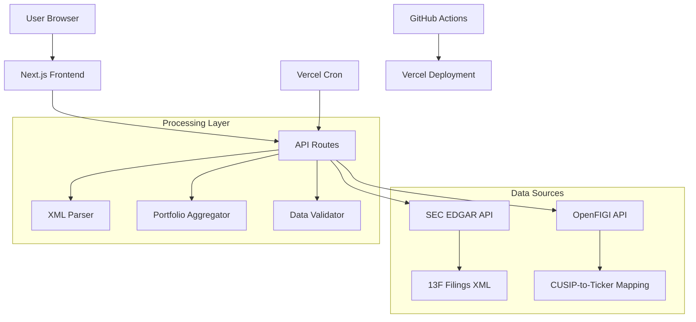

# Architecture Overview

This document provides a comprehensive overview of the 13F Portfolio Tracker's system architecture, data flow, and implementation details.

## 🏗️ System Architecture



## 📊 Data Flow

### 1. 13F Filing Retrieval
```
SEC EDGAR API → Latest Filing Metadata → XML Information Table → Parsed Holdings
```

**Process:**
1. Query SEC submissions API for latest 13F filing per manager
2. Extract accession number and filing metadata  
3. Locate XML information table file (various naming patterns)
4. Parse XML to extract individual holdings

### 2. Portfolio Construction
```
Individual Holdings → Top Position per Manager → CUSIP-to-Ticker Mapping → Equal-Weight Portfolio
```

**Process:**
1. Sort holdings by value, select largest position per manager
2. Map CUSIP identifiers to stock tickers via OpenFIGI
3. Construct equal-weight portfolio (1/N allocation)
4. Apply deduplication if requested

## 🔧 Core Components

### API Layer (`src/app/api/`)

#### Portfolio Endpoint (`/api/portfolio`)
- **Purpose**: Aggregate top picks from all 10 fund managers
- **Caching**: 24-hour revalidation via Next.js `next: { revalidate }`
- **Error Handling**: Graceful degradation, logs failures
- **Response Format**: Standardized `PortfolioResponse` interface

#### Manager Endpoint (`/api/13f/[cik]`)
- **Purpose**: Detailed holdings for individual managers
- **Parameters**: CIK (Central Index Key) identifier
- **Processing**: Full 13F parsing with all positions

### Data Processing Layer (`src/lib/`)

#### SEC EDGAR Integration (`edgar.ts`)
```typescript
// Key functions
getLatest13F(cik: string) // Get latest filing metadata
getInfoTableXMLURL(cik: string, accession: string) // Locate XML file
```

**Challenges Solved:**
- **Diverse naming patterns**: XML files use inconsistent names across filers
- **Fallback strategies**: Multiple patterns + HEAD requests to find correct file
- **Rate limiting**: Respects SEC API requirements

#### 13F XML Parser (`parse13f.ts`)
```typescript
interface Holding {
  cusip: string;
  nameOfIssuer: string;
  value: number; // Market value in thousands
  shares: number;
}
```

**Features:**
- Handles both `infoTable` and `informationTable` XML structures
- Converts string values to numbers with proper validation
- Filters out invalid/empty entries

#### CUSIP Mapping (`mapping.ts`)
```typescript
// Cascade strategy
cusipToTickerWithFallback(cusip: string) → string | null
```

**Mapping Strategy:**
1. **Static mapping**: Common CUSIPs with known tickers
2. **OpenFIGI API**: Real-time CUSIP-to-ticker resolution
3. **Fallback**: Return null if unmappable

### UI Layer (`src/components/`)

#### State Management (`src/store/`)
```typescript
// Zustand store
interface PortfolioStore {
  portfolio: PortfolioResponse | null;
  loading: boolean;
  error: string | null;
}
```

**Features:**
- **SWR Integration**: Automatic revalidation and caching
- **Error States**: Comprehensive error handling
- **Loading States**: Progressive loading indicators

## 🎯 Fund Manager Selection

The application tracks 10 carefully selected fund managers known for:
- **Long-term focus**: Multi-year holding periods
- **Concentrated portfolios**: High-conviction positions
- **Transparency**: Regular, detailed 13F filings
- **Performance history**: Strong long-term returns

## 📅 Update Schedule

### Automatic Updates (Vercel Cron)
```json
// vercel.json
{
  "crons": [
    {
      "path": "/api/portfolio",
      "schedule": "0 6 15 2,5,8,11 *"
    }
  ]
}
```

**Schedule**: Day after typical 13F deadlines
- February 15 (Q4 filings due Feb 14)
- May 16 (Q1 filings due May 15)
- August 15 (Q2 filings due Aug 14)
- November 15 (Q3 filings due Nov 14)

### Manual Refresh
- **Browser**: Natural Next.js revalidation
- **API**: Direct endpoint calls bypass cache

## 🔒 Security & Compliance

### SEC API Compliance
- **User-Agent Header**: Required format with app name and email
- **Rate Limiting**: Built-in delays between requests
- **Respectful Usage**: Caching to minimize API calls

### Environment Variables
```env
SEC_USER_AGENT="AppName (email@domain.com)"  # Required
OPENFIGI_API_KEY="optional-key"              # Optional
```

## ⚡ Performance Optimizations

### Caching Strategy
- **API Routes**: 24-hour Next.js revalidation
- **Static Assets**: Vercel CDN caching
- **Client State**: SWR for request deduplication

### Error Handling
- **Graceful Degradation**: Continue with partial data
- **Retry Logic**: Automatic retries for transient failures
- **Logging**: Comprehensive error tracking

### Parallel Processing
```typescript
// Concurrent manager data fetching
const results = await Promise.all(
  managers.map(manager => fetchManagerData(manager))
);
```

## 🚀 Deployment Architecture

### Preview Deployments
- **Trigger**: Push to `main` branch
- **Environment**: Unique preview URL
- **Purpose**: Safe testing before production

### Production Deployments  
- **Trigger**: GitHub release creation
- **Environment**: Production domain
- **Validation**: Blocking lints and builds

### Infrastructure
- **Platform**: Vercel (serverless)
- **CDN**: Global edge network
- **Database**: Stateless (no persistent storage)
- **Monitoring**: Vercel Analytics + GitHub Actions

## 📈 Scalability Considerations

### Current Limitations
- **10 Managers**: Hard-coded list in `investors.ts`
- **Synchronous Processing**: Sequential SEC API calls
- **No Persistence**: Fresh API calls on each request

### Potential Enhancements
- **Database Layer**: Cache parsed filings
- **Background Jobs**: Asynchronous data updates
- **Rate Limiting**: Client-side request throttling
- **Pagination**: Support for larger manager lists